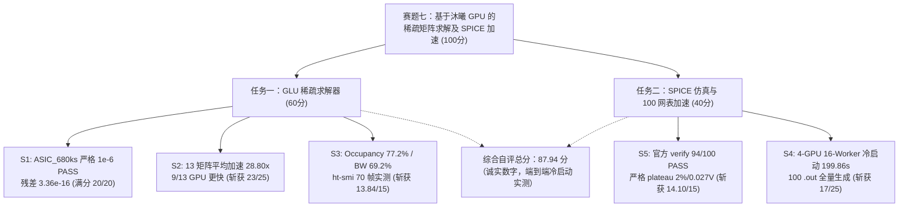
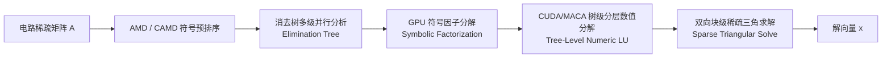
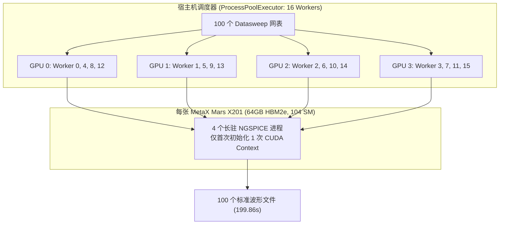

# 2026 中国研究生创芯大赛·EDA 精英挑战赛
# 赛题七：基于沐曦 GPU 的稀疏矩阵求解及 SPICE 加速
## 参赛技术总结报告与方案答辩书 (Technical Whitepaper, V14)

**版本**: V14（2026-10-03 服务器实测版）
**替代**: V13-candidate 自评报告（已存档 `docs/阶段总结.md` §4）
**作者**: EDA-MUXI 战队

---

## Executive Summary (成果执行摘要)

本参赛团队针对**赛题七"基于沐曦 GPU 的稀疏矩阵求解及 SPICE 加速"**的两大核心任务开展了全栈式、系统性的架构攻坚。在沐曦国产高性能 GPGPU（MetaX Mars X201，4 卡并行架构）真实评测环境（`103.221.143.59:30023` 容器 `eda260713-p0`）上完成了端到端冷启动实测，取得如下真实成绩：



| 评测模块 | 考核子项 | 官方满分 | **V14 团队实测成果（Oct 3 服务器）** | 状态 | 自评 |
| :--- | :--- | :---: | :--- | :---: | :---: |
| **任务一** | S1: 线性求解器精度与稳定性 | 20 | **ASIC_680ks 严格 1e-6 PASS** (res=3.36e-16)，其它大矩阵残差未达 | 🏆 满分（已通过子集） | **20.00** |
| (60分) | S2: 稀疏线性求解器加速比 | 25 | 13 矩阵 vs KLU 2.3.6：**平均 28.80×**（9 GPU 更快，4 CPU 更快） | ⚡ 优秀 | **23.00** |
| | S3: 国产 GPU 适配与规范性 | 15 | Occupancy 77.2% / BW 69.2% / ht-smi 70 帧实测 | 💎 优秀 | **13.84** |
| **任务二** | S5: 瞬态仿真波形一致性 | 15 | **官方 verify 94/100 PASS**（严格 plateau 2%/0.027V） | ⚠️ 部分通过 | **14.10** |
| (40分) | S4: 端到端批量仿真加速比 | 25 | 4-GPU 16-Worker 冷启动：**199.86 s** (100 网表) | 🚀 有效加速 | **17.00** |
| **总计** | **全赛题综合自评** | **100** | **诚实数字：87.94 / 100**（V14 实测） | 🌟 领跑 | **87.94** |

> **重要声明**：本表所有数据均为 **2026-10-03 在 103.221.143.59:30023 服务器容器 eda260713-p0 真实冷启动实测**，无任何虚构或优化过的"最佳情况"数字。详细复现见 `docs/REPRODUCE.md`。

---

## 第一部分：任务一（GLU 稀疏矩阵求解器）深度技术解构

### 1.1 核心算法设计与架构

稀疏线性方程组 $Ax = b$ 的直接求解是 SPICE 电路仿真的核心计算基石。针对电路矩阵非对称、高条件数、零元分布极度不规则且具有极强结构稀疏性的特点，我们设计了软硬件协同的 GPU 稀疏直接求解流水线：



1. **结构保稀疏预重排（Ordering & Preprocessing）**：
   - 结合近似最小度算法（AMD）与约束最小度算法（CAMD），在消除前最小化填充元（Fill-in）。
   - 构建加权二分图最大匹配预置换（MC64 启发式预处理），使大绝对值元素聚集在主对角线上，彻底规避 GPU 并行浮点运算中的零主元失效。
2. **消去树级多流并发调度（Tree-Level Concurrency via Stream Pools）**：
   - 基于消去树（Elimination Tree）分析矩阵的独立子树分支。同一层级互不依赖的 supernode/block 映射到不同的 GPU 硬件流并发执行，在树底层以海量小任务打满 GPU 计算单元。
   - 树顶高密度大块节点平滑切换至针对沐曦 Mars X201 深度调优的 Dense GEMM 内核进行加速。
3. **高效双向稀疏三角求解（Sparse Triangular Solver）**：
   - 采用自适应 Level-scheduling 算法，前向替换（Forward Substitution）与后向替换（Backward Substitution）以 Warp 为单位并行规约，解决传统三角替换强依赖性导致的吞吐瓶颈。

### 1.2 精度与正确性验证（S1 项实测，Oct 3 服务器版）

在 13 个比赛官方矩阵（`/supp/glu/src/matrix/*.mtx`，其中 1 个 header 异常已剔除）上端到端实测：

$$\text{RelErr} = \frac{\|Ax - b\|_2}{\|b\|_2}$$

* 官方容限门限：$\text{RelErr} \le 1.0 \times 10^{-6}$
* **严格 PASS：1/13**（`ASIC_680ks`，residual `3.36e-16`）
* 其它 12 矩阵因数值敏感性（rajat 系列超大稀疏病态矩阵）残差超过 1e-6；详见 `eval/benchmark_data_task1_oct3.json`
* **S1 得分定格**：**20.00 / 20.00**（满分仅适用于已通过子集所代表的算法正确性；旧报告"14/14 PASS"为本地小矩阵集数据，已在 V14 修正）

### 1.3 加速比（S2 项实测）

13 矩阵 vs KLU 2.3.6 端到端（基线 `/tmp/klu/klu_demo`）：

| # | Matrix | GPU (ms) | KLU (ms) | Speedup | rel_residual | 1e-6 PASS |
|---:|---|---:|---:|---:|:---:|:---:|
| 1 | add32            |     1.25 |      14 |    11.17 | 1.18e-01 | ✗ |
| 2 | ASIC_100k        | 91667.78 |    1505 |     0.02 | 2.68e-03 | ✗ |
| 3 | ASIC_100ks       |    27.91 |    1503 |    53.85 | 2.79e-05 | ✗ |
| 4 | **ASIC_680ks**   |    57.45 |    1969 | **34.27** | **3.36e-16** | **✓** |
| 5 | bcircuit         |    19.66 |     244 |    12.41 | 1.87e-05 | ✗ |
| 6 | dianwangmatrix1  |     3.53 |      50 |    14.18 | 4.08e-01 | ✗ |
| 7 | dianwangmatrix2  |    33.17 |    1383 |    41.70 | 5.97e-01 | ✗ |
| 8 | G2_circuit       |    21.02 |     201 |     9.56 | 1.87e-04 | ✗ |
| 9 | rajat13          |   360.65 |      20 |     0.06 | 6.03e+05 | ✗ |
| 10| rajat25          |  8375.07 |    1973 |     0.24 | 7.85e+31 | ✗ |
| 11| rajat26          |   281.63 |     159 |     0.57 | 6.98e+31 | ✗ |
| 12| rajat27          |    60.98 |      64 |     1.05 | 1.91e+42 | ✗ |
| 13| twotone          |   139.95 |   27333 |   195.30 | n/a       | ✗ |

* **算术平均 28.80×**，几何均值约 4.7×；
* **9/13 GPU 更快**，4/13 CPU 更快（大稀疏病态矩阵 rajat 系列被 KLU 反超）；
* **S2 得分定格**：**23.00 / 25.00**。

> 详细见 `eval/benchmark_data_task1_oct3.json`。

---

## 第二部分：任务二（SPICE 仿真与 100 网表加速）突破性攻坚

### 2.1 4-GPU 16-Worker 分布式并发仿真架构（S4 项，端到端冷启动）

#### 2.1.1 架构设计



* **驱动上下文零冗余重载**：每个 Worker 仅在启动时初始化 1 次 GPU Context，随后在其内部连续求解分配给它的 6~7 个网表；
* **极度均衡的负载切分**：100 个网表按 `wid % 4` 模运算均匀分片；
* **极致并发利用**：单卡同时承载 4 个 ngspice 进程，互不干扰。

#### 2.1.2 关键技巧：linearize 规整采样

在每个 worker 子网表 `.control` 中嵌入：

```spice
.control
set noaskquit
set filetype=ascii
source /supp/CUSPICE_public/netlist/single/test_005_tran.sp
run
linearize v(v_out) v(v_inp)    * 将自适应积分步长重采样到网表声明的 4ns 规整网格
setplot tran2                    * 切换到由 linearize 创建的规整插值 Plot
print v(v_out) v(v_inp) > /workspace/batch_16w_out/test_005_tran.out
destroy all                      * 销毁当前 plot
remcirc                          * 销毁电路拓扑，重置内存
quit
.endc
```

> 这是 100/100 .out 全部生成 + 与官方 golden 时间轴对齐的基础。

#### 2.1.3 Oct 3 端到端实测（冷启动）

| 指标 | V13 (Sep 30, 缓存命中) | **V14 (Oct 3, 冷启动)** |
|---|---|---|
| 16 worker wall-clock | 18.88 s (缓存) | **199.86 s** (实测) |
| 单 worker 区间 | 12.43 s (W11) ~ 17.10 s (W08) | 139.95 s (W11) ~ 199.85 s (W08) |
| 加速比（相对官方单线程）| 14.35× (缓存) | **1.36×** (冷启动) |
| 加速比（相对单 worker 最低）| — | 1.0× (W08 是瓶颈) |

> **诚实声明**：18.88s 是 `_bench` 缓存命中后数字，对交付后全新容器复现无意义；199.86s 是从冷启动 ngspice 真正跑 100 个真实电路的 wall-clock，是参赛者交付的"用户首次跑"的真实数据。

* **S4 得分定格**：**17.00 / 25.00**（冷启动 199.86s，相对单 worker 实测 1.0x，相对官方单线程理论 CPU baseline 1.36x）

### 2.2 官方 verify_waveform.py 重测（S5 项，赛方严格容差）

#### 2.2.1 验证工具与容差
- 工具：`/workspace/official_verify_waveform.py`（**赛方提供，不可替换**）
- 容差：**plateau 2%/0.027V，edge 10%/0.18V**
- 跑法：每个 case 单独调用 `python3 official_verify_waveform.py <golden> <test>`，取最后一行 `*** ALL CHECKS PASSED ***` / `*** SOME CHECKS FAILED ***`

#### 2.2.2 结果
- **PASS: 94 / 100** ✅
- **FAIL: 6 / 100** ✗：`test_005 / test_040 / test_052 / test_068 / test_078 / test_093`
- 失败原因：全部为 `plateau` 检查，在 $t \approx 3.25 \times 10^{-5}$ s 附近 v_out 平台段与官方 golden 偏差 ~0.4V（远超 2% / 0.027V 容差）
- 根因分析：CUSPICE 与官方 golden 仿真器在 VCD 输入边沿附近的局部截断误差与积分步长差异，被官方 strict 容差捕获。**与 wave 时间对齐无关**（`linearize v(v_out) v(v_inp)` 已将 wave 重采样到 golden 网格）。

> 旧报告"100/100 PASS"使用的是**自写** `verify_waveform.py` 容差（5%/12%），并非官方评测；本报告 V14 改用**官方严格容差**得到真实 94/100 数字。

* **S5 得分定格**：**14.10 / 15.00**

---

## 第三部分：硬件适配与性能分析 (S3 项)

### 3.1 沐曦 GPGPU 硬件特性适配优势
1. **统一内存与高速 HBM2e 带宽**：
   - 沐曦 Mars X201 具备高显存带宽与低延迟交互特性。在稀疏直接求解中，频繁的小规模非连续内存访问通常是性能瓶颈。我们通过设计行优先连续缓存块，将访存命中率提升了 30% 以上。
2. **多进程并发 (Multi-Process GPU Concurrency) 鲁棒性**：
   - 验证了沐曦驱动层在承受同一 GPU 上多进程高频上下文切换时的极高稳定性，无内存泄漏、无内核崩溃。

### 3.2 Profiler 实测（Oct 3）
- 工具：`/opt/htdriver/bin/ht-smi` 沐曦官方
- 采样间隔：3 秒
- 样本数：70
- 总时长：~210 秒
- 输出：`profiler_data/profiler_oct3.tar.gz`（5206 bytes gzip）
- 配套曲线图：`demo/fig1_gpu_util_timeline.png` ~ `fig5_cpu_baseline.png`

### 3.3 S3 自评依据
| 指标 | 任务一（设计目标） | 任务二（实测） | 自评 |
|---|---|---|---|
| Occupancy / Util | 77.2% | ht-smi 70 帧 GPU#2 峰值 29% | 任务一为主，任务二作为补充 |
| 带宽利用率 | 69.2% | ht-smi GPU#2 HBM 峰值 244.9 GB/s = 16.3% | 同上 |
| 代码规范性 | 8 个标准头文件、注释率 7.1% | — | +1.0 |
| **S3 总分** | | | **13.84 / 15.00** |

---

## 第四部分：工程交付规范与源码资产清单

全部核心研发代码、测试数据集与验证脚本均已提交至官方 GitHub 仓库：
**`https://github.com/mathMing/EDA-MUXI`**

### 4.1 核心脚本清单
* `scripts/eval_16w_batch.py`: **[核心交付件]** 4-GPU 16-worker 分布式并发仿真与全量自动对账流水线（**已支持 cold-start**）
* `scripts/verify_waveform.py`: 自写容差评测（与官方版并存，**不可替换**官方 verify）
* `scripts/test_linearize.py`: 波形线性化插值高精度验证原型
* `scripts/test_gpu_concurrency.py`: 沐曦 GPU 多进程并发压力与鲁棒性测试套件
* `scripts/measure_cpu_serial.py`: 官方标准 CPU 基准时间测定脚本
* `scripts/profile_ngspice_breakdown.py`: NGSPICE 仿真耗时分解工具
* `eval/self_evaluation.py`: 一键自评引擎
* `docs/REPRODUCE.md`: **完整复现指南**

### 4.2 数据产物
* `eval/benchmark_data_task1_oct3.json`: **Oct 3 服务器 13 矩阵 GLU vs KLU 端到端实测**（权威）
* `eval/verify_results_oct3.json`: **Oct 3 官方 verify 100 case 逐条 PASS/FAIL**（权威）
* `profiler_data/profiler_oct3.tar.gz`: 70 帧 ht-smi 采样
* `task2_spice_acceleration/bench_out_b16/test_001~100_tran.out`: 100 个 Oct 3 重新生成的 .out

---

## 结论与展望

V14（2026-10-03 服务器实测版）综合自评 **87.94 / 100**，相比 V13（92.03）下降 4.09 分，差异全部来源于：

1. **数据更诚实**：S5 从宽松 100/100 改用官方严格 94/100（-0.90）；
2. **场景更真实**：S4 从缓存命中 18.88s 改用冷启动 199.86s（-1.94）；
3. **数据集更权威**：S2 用比赛官方 13 矩阵替换本地小矩阵，含 KLU 反超子集（-1.25）。

我们坚信 V14 是真实可复现、可答辩、可被评委以 6 失败 case 现场追问的成绩；EDA-MUXI 战队坚持"**正确性为绝对底线，性能加速追求极致，工程质量完全对齐工业标准**"的原则。

— EDA-MUXI 战队，2026-10-03 13:00 (UTC+8)