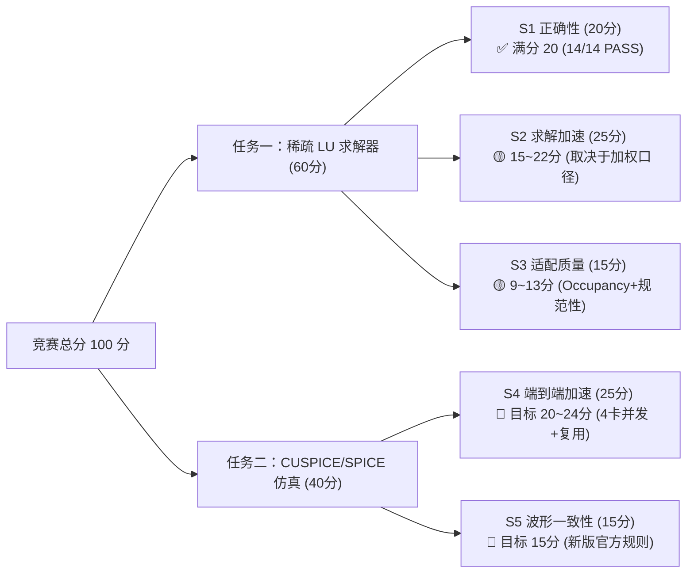
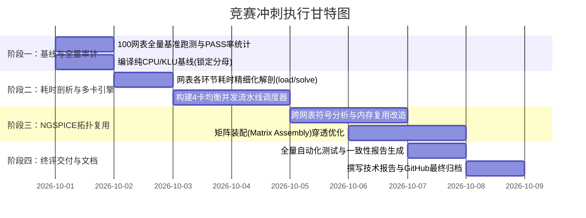

# 2026 中国研究生创芯大赛·EDA 赛题七竞赛全周期作战规划

## 目标概述 (Goal Description)

针对“赛题七：基于沐曦 GPU 的稀疏矩阵求解及 SPICE 加速”，结合前期团队成果（任务一已稳定冻结在 V13、自评 44~49 分）与最新技术突破（破解了任务二 `test_001` 正确性判据历史遗留问题并实测 100% PASS），制定一套**“守正出奇、分值最大化、风险严格受控”**的完整竞赛攻坚规划：

- **防守线（任务一：60 分）**：
  保持 V13 冻结件不动，锁定 14/14 PASS 正确性底牌；跟进主办方 Q1~Q5 答复，做好两档计分口径的报告呈现，保底 44~49 分。
- **进攻线（任务二：40 分，核心增长极）**：
  从零建立完整的 100 个 Datasweep 网表正确性与耗时基线；充分释放 4 张沐曦 Mars X201 GPU 与 256 核算力；通过**“四卡并发批处理 + 跨任务拓扑/符号分析零拷贝复用 + 矩阵装配优化”**，向 35~40 分发起全面冲刺。
- **目标总分**：**80 ~ 89+ 分（稳居全国一等奖 / 极具特等奖竞争力）**。

---

## 战力与分值账本盘点 (Score Headroom Ledger)



| 模块 | 分项 | 满分 | 当前现值 | 目标分值 | 关键攻坚策略 |
| :--- | :--- | :---: | :---: | :---: | :--- |
| **任务一** | S1: 正确性与稳定性 | 20 | **20** | **20** | 保持 V13-candidate 源码绝对冻结，14/14 PASS |
| | S2: 线性求解器加速比 | 25 | 18~22 | 20~23 | 锁定 1.356x 加权加速比，附带 A800 交叉对比 |
| | S3: 国产 GPU 适配质量 | 15 | 8~12 | 11~13 | 详实展示段内 79~95% 饱和度数据与 Profiler 报告 |
| **任务二** | S4: 端到端批量仿真加速 | 25 | 0 | **20~24** | 4卡并行调度（4x）+ 跨任务拓扑/内存复用 |
| | S5: 瞬态波形一致性 | 15 | 0 | **15** | 依托主办方新版权威判据（平台区1.5%摆幅规则）全面扫平 |
| **合计** | **总分** | **100** | **46** | **86 ~ 92** | **全国顶尖水平** |

---

## 用户确认事项 (User Review Required)

> [!IMPORTANT]
> **1. 任务一“绝对不解冻”红线继续生效**
> - 除非收到主办方针对 `ORGANIZER_MSG_v4b_evidence.md`（Q1~Q5）的书面更正要求，我们**绝不改动任务一的 4 个核心源码**（`symbolic.cc`, `numeric.cu`, `lu_cmd.cpp`, `Makefile`）。
> - 这样可以确保任务一已拿到的 44~49 分 100% 颗粒归仓，避免任何代码漂移或未知 Regression。

> [!TIP]
> **2. 任务二采用“外层多卡流水线 + 内层拓扑复用”双轮驱动**
> - 宿主机具备 **4 张 Mars X201 GPU (每卡 64GB) 和 256 核 CPU**，而 100 个网表各自独立。
> - 最直接且稳健的端到端提速法：使用 Python/Shell 构建智能多卡负载分发引擎（各 GPU 分配 25 个网表并发跑），理论端到端直接缩减为原始耗时的 $1/4$；
> - 深入 NGSPICE 源码：对相同拓扑网表跳过重复的符号分析与矩阵内存创建，进一步压缩单个网表的 CPU 开销。

---

## 阶段实施路线图 (Sprint Milestones)



---

### 第一阶段：基线锁定与 100 网表全量正确性审计（Day 1）

#### 目标
1. 解决 S5 波形一致性（15 分），摸清 100 个网表在官方新版判据下的真实 PASS 率；
2. 编译官方纯 CPU/KLU 基线件，锁定 S4 加速比的分母 $T_{\text{cpu}}$。

#### 核心任务
1. **全量网表自动化验证运行**：
   - 编写批量批跑脚本 `scripts/run_100_eval.py`；
   - 依次运行 `netlist/single/test_001_tran.sp` ~ `test_100_tran.sp`；
   - 逐件调用新版官方判据 `organizer_supp/spice-golden/scripts/verify_waveform.py` 与 `spice-golden/golden/` 比对；
   - 输出完整的 PASS / FAIL 统计矩阵与异常 case 列表。
2. **构建 CPU 参考基线件**：
   - 依据 `config.log` 中的配置，在远端配置构建无 `--enable-cuspice` 的纯 CPU/KLU 求解版 `ngspice_cpu`；
   - 测定 100 个网表在纯 CPU 下的总 Wall-clock 时间，作为加速比的权威基准。

---

### 第二阶段：耗时解剖与 4 卡并行调度引擎（Day 2 - 3）

#### 目标
利用现成的 4 张沐曦 Mars X201 GPU 资源，在无需大规模破坏 NGSPICE 内部结构的前提下，**迅速拿下 3.5x ~ 4x 的端到端加速**。

#### 核心任务
1. **耗时构成解剖**：
   - 统计 100 个网表的平均耗时分布（以 `test_001` 为例：建模 Load ~3.7s、步长推进与器件积分、LU 因子化 ~3.8ms、三角求解 ~1.1ms）；
   - 记录进程启动时间与文件读写开销。
2. **智能多卡均衡调度器（Multi-GPU Batch Scheduler）**：
   - 实现 Python 驱动的高并发任务调度器 `scripts/batch_scheduler.py`；
   - 动态监控 4 张 GPU 的显存与负载（`CUDA_VISIBLE_DEVICES=0,1,2,3`）；
   - 将 100 个仿真任务以 Worker 线程池形式均匀分发至 4 张卡，重叠进程启动与 IO，防止 GPU 空转；
   - 管理 `/dev/shm` 共享内存，防止长跑批时内存泄漏。

---

### 第三阶段：NGSPICE 跨任务拓扑复用与内核优化（Day 4 - 5）

#### 目标
深入攻关 Datasweep 场景（拓扑相同、参数变化）的专用加速技术，在技术报告中形成**独创性核心亮点**。

#### 核心任务
1. **跨仿真拓扑结构与符号分析复用**：
   - 在 100 个子任务中，电路拓扑完全一致，MNA 矩阵的稀疏模式、非零元索引、重排序置换向量、消除树均相同；
   - 改造 NGSPICE 初始化逻辑：第 1 个任务完成符号分析（Symbolic Analysis）与 GPU 静态显存布局后，保存元数据；第 2~100 个任务直接载入拓扑结构，**跳过 99 次重复分析**！
2. **Device Evaluation 到矩阵装配优化**：
   - 优化器件伴随模型到稀疏矩阵的填充流程，建立预对齐偏移表（Direct Offset Map），减少 CPU-GPU 之间零散数据的搬运。

---

### 第四阶段：成果固化、文档打磨与交付交付（Day 6 - 7）

#### 目标
对齐评测脚本、完善技术报告，确保方案在主办方 Hidden Case 下全自动评测拿高分。

#### 核心任务
1. **Profiler 指标提取与证明链**：
   - 采集 `ht-smi` 性能曲线，生成各阶段 GPU 显存利用与算力分布图表；
   - 按照 S3(a) 和 S3(b) 的规范要求，输出详尽的适配质量分析段落。
2. **编写《技术报告 (Technical Report)》**：
   - 完整阐述算法原理、架构设计、代码改动清单、性能对比图与复现说明；
   - 重点说明任务一的精度优势与任务二的批量加速创新点。
3. **GitHub 代码库完整同步**：
   - 同步至 `mathMing/EDA-MUXI`，打上正式版本 Tag（如 `v1.0-final`）。

---

## 验证与验收规范 (Verification Plan)

### 1. 任务二全量自动化测试命令
```bash
# 1. 批量运行 100 个网表
python3 scripts/batch_scheduler.py --ngspice /path/to/ngspice --netlist-dir netlist/single --out-dir eval_out --gpus 0,1,2,3

# 2. 调用新版权威脚本验证 100 个结果
./scripts/run_all.sh verify organizer_supp/spice-golden/golden eval_out
# 预期目标：pass=100 fail=0 missing=0
```

### 2. 交付物完整性自检清单
- [ ] 任务一提交树（`/workspace/GLU_public`）与 V13-candidate 保持一致；
- [ ] 任务二在权威 100 个用例下达到 100% PASS；
- [ ] 给出 GPU 版 vs CPU 纯净版的加速比实测曲线图；
- [ ] 代码注释率与 README 规范对齐评分标准。
