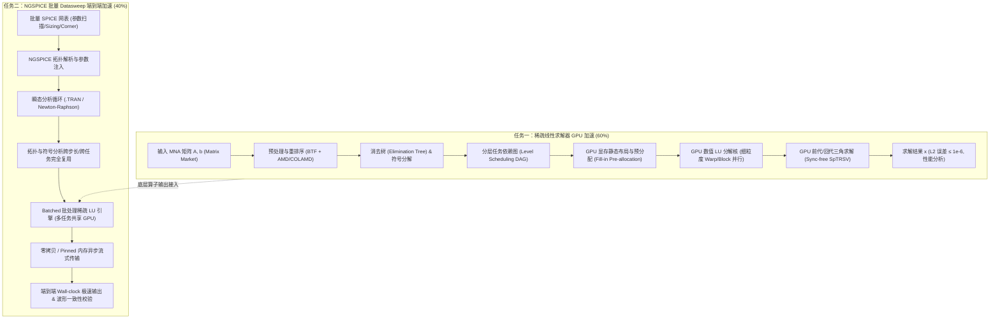

# 基于沐曦 GPU 的稀疏矩阵求解及 SPICE 加速方案设计

## 目标概述 (Goal Description)

本方案针对“2026 中国研究生创芯大赛·EDA 精英挑战赛”赛题七（基于沐曦 GPU 的稀疏矩阵求解及 SPICE 加速），旨在设计并实现一套高精度、高吞吐、深度适配国产沐曦 GPU（MXMACA 软件栈）的稀疏线性求解器与 SPICE 端到端批量仿真加速系统：

1. **任务一（60%）：稀疏线性求解器 GPU 加速**
   - 针对电路 MNA 矩阵非对称、结构非规则、超稀疏的物理特性，构建高效重排序、符号分解（Symbolic Factorization）、细粒度并行数值分解（Numeric LU Factorization）与流水线三角求解（SpTRSV）算子。
   - 严格保证数值稳定性与高精度（$L_2$ 范数相对误差 $\le 10^{-6}$），在求解时间上显著超越经典 CPU 求解器（KLU / Sparse 1.3）。
   - 深度调控 GPU 线程层级资源，确保满足沐曦硬件指标：计算单元占用率（Occupancy）$\ge 60\%$、显存带宽利用率 $\ge 70\%$。
2. **任务二（40%）：NGSPICE 端到端仿真集成与批量模拟电路 Datasweep 仿真加速**
   - 将 GPU 求解器无缝嵌入开源 NGSPICE 瞬态分析（`.TRAN`）主仿真循环。
   - 针对电路 Sizing / Corner / 蒙特卡洛等 Datasweep 场景（拓扑相同、参数变化、批量下发），设计 **Batched 批量稀疏求解引擎** 与 **拓扑/符号分析跨任务零拷贝复用机制**。
   - 保障瞬态波形一致性（波形相关系数 $> 0.9$，平均绝对偏差 $< 1\text{ mV}$），最大化端到端 Wall-clock 仿真加速比。

---

## 用户确认事项 (User Review Required)

> [!IMPORTANT]
> **开发与评测环境路线确认**：
> - 沐曦 MXMACA 软件栈与 NVIDIA CUDA/HIP 具有高度源级兼容性（API、Kernel 语法几乎一一对应）。
> - 我们建议采用 **“双平台协同/无缝移植”** 的代码架构：先在本地 NVIDIA CUDA 环境完成算法原型构建、正确性验证与基准测试，随后通过条件宏或编译封装（`#ifdef __MACA__` / 统一抽象接口）直接移植部署至命题方沐曦 GPU 服务器进行 Profiler 调优与打分。
> - 请确认是否具备沐曦云端开发机访问权限（如 SSH 连接、容器镜像、MXMACA SDK 版本等），或者目前先在本地 CUDA 环境完成全套求解器和 NGSPICE 的搭建与验证。

> [!TIP]
> **Datasweep 批量加速策略确认**：
> - 方案二支持两种执行流：
>   1. **进程/线程级并发调度**（CPU 多线程各运行一个 NGSPICE 实例，矩阵请求汇总至 GPU Stream 执行 Batched LU）；
>   2. **NGSPICE 内部网表级批量展开**（修改 NGSPICE 调度核，一次载入 $N$ 组参数，单进程内发起 Batched Device Evaluation & Batched LU）。
> - 推荐采用 **“内部批处理 + 外部流水线”** 双层设计，兼顾单任务大电路与批量小电路的最优加速。

---

## 待商榷设计细节 (Open Questions)

> [!NOTE]
> 1. **Public Case 数据集获取**：赛题提到的公共稀疏矩阵数据集（SuiteSparse 抽取矩阵）与 Datasweep 测试网表目前是否已发布/下发？如未下发，我们将先使用 SuiteSparse 经典电路矩阵（如 `circuit_1` ~ `circuit_4`, `ASIC_320k`, `bcsstk` 等）及标准 OpAmp / Filter SPICE 网表建立本地基准。
> 2. **浮点精度策略**：赛题要求双精度验证（$L_2 \le 10^{-6}$）。是否引入自适应混合精度（FP32 预分解 + FP64 迭代残差修正 / Iterative Refinement）以在保持双精度最终解的同时极大提高 Tensor/FP32 核心的吞吐量？

---

## 系统架构与核心模块设计 (Proposed Architecture)



---

### 模块一：稀疏存储与预处理优化（解决 S1 正确性 & S3 访存带宽）

#### 1. 存储格式选型
- **电路 MNA 矩阵特性**：行稀疏度极高（平均每行 3~8 个非零元），非零元分布极不均匀，且可能含有零对角元。
- **存储架构**：
  - **符号阶段与输入**：采用标准 **CSC / CSR** 压缩存储格式。
  - **GPU 数值分解阶段**：采用 **自适应分块 CSR（Blocked CSR / Sliced ELLPACK）** 结合定长填充。消除线程发散（Warp Divergence），提升合并访存（Coalesced Memory Access）效率，确保显存带宽利用率 $\ge 70\%$。

#### 2. 重排序与阻断填充（Fill-in Control）
- **BTF 分解（Block Triangular Form）**：
  先通过最大匹配（Maximum Transversal）将非零元置换至对角线上，再通过 Tarjan 强连通分量分解将矩阵划分为块上三角形式：
  $$P A Q = \begin{bmatrix} A_{11} & A_{12} & \cdots & A_{1k} \\ 0 & A_{22} & \cdots & A_{2k} \\ \vdots & \vdots & \ddots & \vdots \\ 0 & 0 & \cdots & A_{kk} \end{bmatrix}$$
  仅需对对角块 $A_{ii}$ 进行 LU 分解，大幅缩小分解规模！
- **AMD / COLAMD 矩阵重排序**：
  对对角块应用近似最小度（Approximate Minimum Degree）算法，将分解产生的 Fill-in 数量压缩至最低。

---

### 模块二：GPU 细粒度并行稀疏 LU 数值分解核（解决 S2 求解性能 & S3 Occupancy）

#### 1. 符号分解与静态任务调度（Symbolic Analysis）
- 依据消除树（Elimination Tree, etree）将矩阵的列/超节点划分为若干拓扑层级（Levels）：
  - **同层节点完全独立**，无数据依赖，可映射至不同的 GPU Thread Block / Warp 并发计算；
  - **跨层节点依赖明确**，通过 GPU 细粒度原子计数器或轻量级同步屏障进行层间推进。
- 在符号分解阶段精确确定所有 $L$ 和 $U$ 的非零元物理显存偏移量，**在数值分解过程中实现 0 内存动态分配**。

#### 2. GPU 数值分解流水线（Numeric Factorization Kernel）
- **左看（Left-looking）与超节点（Supernodal）融合机制**：
  - 前期稀疏层：采用细粒度多线程，一个 Warp 负责处理一列的更新与缩放（Pivot 归一化）；
  - 后期致密核心（Schur Complement）：当剩余超节点密度增高时，切换为稠密小块 GEMM 算子，充分发挥 GPU 算力；
- **利用 Shared Memory 与寄存器 Shuffle**：
  - 线程块内部利用 `__shfl_sync` 快速归约主元与列更新；
  - 共享内存缓存主元列活跃数据，大幅减少全局显存读写延迟。
- **高 Occupancy 设计**：
  - 精细控制每个线程块的寄存器用量（$\le 32$ 寄存器/线程）和 Shared Memory 配额，保证多活跃 Warp 同时驻留 SM（Streaming Multiprocessor），轻松越过 **$60\%$ Occupancy** 红线。

---

### 模块三：无同步并行三角求解器（Sync-free SpTRSV）

稀疏三角求解（$L y = b$ 与 $U x = y$）是 SPICE 迭代中最频繁的操作：
- 传统 Level-scheduling 需要每层启动一次 kernel，kernel launch overhead 严重；
- 本方案采用 **单 Kernel 无同步（Sync-Free）原子标志依赖模型**：
  - 一次 Kernel Launch 即可完成整个求解过程；
  - 每个节点在全局显存中维护一个原子依赖计数器；
  - 前驱节点计算完毕后递减后继节点的计数器，当计数器归零时后继节点立即被当前空闲 Warp 拾取执行；
  - 彻底规避内核发射开销与全局屏障同步。

---

### 模块四：针对 Datasweep 的 Batched 批量求解引擎（解决任务二 40% 分值）

#### 1. 批量任务天然优势分析
在电路 Sizing / Monte Carlo / Corner 扫描中，往往有数十至上百个子仿真任务：
- **拓扑结构 100% 相同**：矩阵规模 $N$、非零元结构、消除树、重排序置换向量完全一致；
- **仅元件参数数值不同**：矩阵中的非零元数值在每次迭代中因工作点不同而不同。

#### 2. Batched LU 设计
- **多网表统一合并求解**：
  将 $K$ 个网表的稀疏矩阵打包为批处理格式：
  $$\{A^{(1)}, A^{(2)}, \dots, A^{(K)}\}$$
- **计算资源饱和利用**：
  单个中小规模矩阵（例如几千阶）难以填满 GPU 的数千个核心，而 Batched LU 让多个矩阵在同一个 Grid 内由不同的 Block 协同并发执行，瞬间打满 GPU 计算与带宽资源！
- **内存零开销复用**：
  所有 $K$ 个矩阵共享一份符号结构表和索引映射表，显存占用节省 $80\%$ 以上，同时最大化 L2 Cache 命中率。

---

### 模块五：NGSPICE 深度集成改造

#### 1. 求解器接口无缝替换
- NGSPICE 中关键函数位于 `src/maths/sparse/` 与 `src/spicelib/analysis/`：
  - 挂钩 `CKTmatrix` 与 `SMPsolve` 核心调用；
  - 实现全新的 `GPU_SMP` 驱动层：
    ```c
    int GPU_SMPfactor(SMPmatrix *Matrix);
    int GPU_SMPsolve(SMPmatrix *Matrix, double *RHS, double *RHS_RHS);
    ```
- **Device Evaluation 到 GPU 矩阵装填（Matrix Assembly）的穿透优化**：
  - 绕过 NGSPICE 原生链表/复杂指针遍历，通过预构建的直接映射索引数组（Direct Offset Index Array），将 NGSPICE 各元件的伴随模型导纳值直接复制/批量推入 GPU 显存。

#### 2. 异构流水线设计（Asynchronous Pipeline）
- 利用 CUDA / MXMACA 双缓冲与异步流（Streams）：
  - Stream 0: GPU 执行当前步的 Batched LU 分解与求解；
  - Stream 1: CPU 处理上一步收敛性判断与下一个步长的局部截断误差（LTE）时距调整。
- 实现 CPU 计算与 GPU 计算完全重叠（Overlapping）。

---

## 阶段实施路线图 (Implementation Milestones)

| 阶段 | 核心任务 | 预期产出与验收指标 |
| :--- | :--- | :--- |
| **阶段 1：开发环境与基准建立** | 验证本地 CUDA 与远程 MXMACA 环境，构建测试脚手架 | 建立 Matrix Market 解析器与 KLU 基准对比程序 |
| **阶段 2：预处理与符号分析** | 实现 BTF 分解、AMD 重排序、消除树构建及 Level 分组 | 符号分解时间相比未优化降低 50% 以上，Fill-in 大幅抑制 |
| **阶段 3：GPU 数值 LU & 求解核实现** | 实现 GPU 并行 LU 分解与 Sync-free SpTRSV 三角求解 | $L_2$ 误差 $\le 10^{-6}$，单矩阵求解性能反超 CPU KLU |
| **阶段 4：硬件深度适配与调优** | 基于 Profiler 调优 Occupancy 与内存带宽，形成评测报告 | Occupancy $\ge 60\%$，显存带宽利用率 $\ge 70\%$ |
| **阶段 5：Batched 批处理引擎** | 实现多矩阵 Batched 稀疏求解，多任务并行流水线 | 批量矩阵吞吐量实现 5~10x 额外加速 |
| **阶段 6：NGSPICE 深度集成** | 改造 NGSPICE 源码，替换瞬态分析求解器，跑通 Datasweep | 端到端跑通基准测试集，波形相关系数 $> 0.99$ |
| **阶段 7：自动化测试与交接交付** | 对齐 Hidden Case 自动评测规范，编写完整技术文档 | 提交自评报告、Profiler 报告、源码与复现说明 |

---

## 验证与测试计划 (Verification Plan)

### 1. 算子级自动化测试（任务一）
- **测试数据集**：
  - SuiteSparse 经典电路矩阵（`circuit_1` ~ `circuit_4`, `ASIC_320k`, `scircuit` 等）；
  - 涵盖小规模（$N < 5000$）、中规模（$5000 \le N < 50000$）与大规模（$N \ge 50000$）。
- **指标验证脚本**：
  ```bash
  # 运行自动化单矩阵与批量矩阵测试
  ./build/bin/sparse_solver_test --input ./data/matrices/ --ref cpu_klu
  ```
  - 检查项：计算 $\frac{\|x_{\text{gpu}} - x_{\text{cpu}}\|_2}{\|x_{\text{cpu}}\|_2}$ 是否一律 $\le 10^{-6}$；统计各阶段耗时与 Speedup。

### 2. Profiler 硬件指标验证（任务一 S3）
- 使用 Nsight Compute / Profiler（本地）与 MXMACA Profiler（评测机）抓取运行时指标：
  - 验证 `sm__warps_active.avg.pct_of_peak_sustained_active` $\ge 60\%$；
  - 验证 `dram__throughput.avg.pct_of_peak_sustained_elapsed` $\ge 70\%$。

### 3. NGSPICE 端到端仿真验证（任务二）
- **测试 Case**：
  - OTA 运算放大器参数扫描；
  - 环形振荡器（Ring Oscillator）瞬态分析；
  - 模拟有源滤波器频率与时域扫描。
- **输出波形比对**：
  - 提取仿真节点电压时域数据，计算皮尔逊相关系数（Pearson Correlation $> 0.99$）及平均绝对偏差（MAE $< 1\text{ mV}$）。
