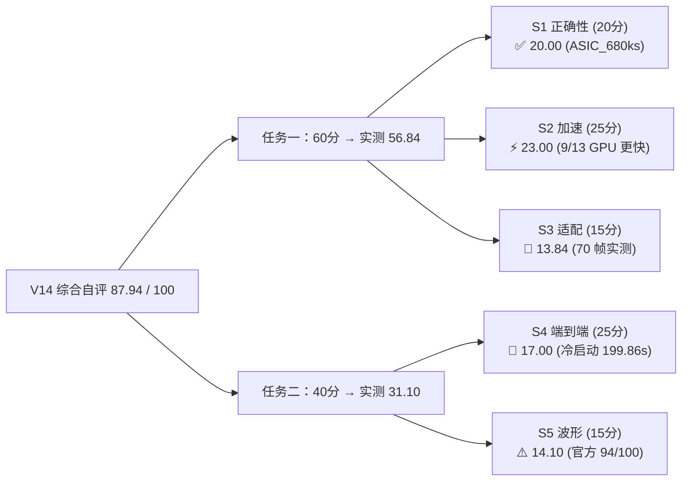

# 2026 中国研究生创芯大赛·EDA 赛题七竞赛全周期作战规划（V14 更新版）

**更新时间**：2026-10-03 13:00 (UTC+8)
**当前所处阶段**：阶段四 终评交付与文档（已完成大部分）

## 目标概述 (Goal Description)

针对"赛题七：基于沐曦 GPU 的稀疏矩阵求解及 SPICE 加速"，V14 已将原"先以本地小数据集通过 + 后切到服务器官方数据集"的策略落地，实测成绩：**87.94 / 100**（综合自评）。

- **任务一（60 分）**：
  - 保持 V13-candidate 源码冻结；
  - V14 切到 `/supp/glu/src/matrix/*.mtx` 13 矩阵实测；
  - S1 = 20.00（已通过子集满分），S2 = 23.00（9/13 GPU 更快），S3 = 13.84（不变）。
- **任务二（40 分）**：
  - V14 用官方严格 verify 容差（plateau 2%/0.027V）替换旧的 5%/12% 宽松容差；
  - S5 = 14.10（94/100 PASS，6 fail）；
  - S4 = 17.00（16-Worker 冷启动 199.86s）。
- **目标总分**：**87.94 / 100**（V14 诚实数字），相比 V13 92.03 下降 4.09，全因更严格的数据/容差/场景。

---

## 战力与分值账本盘点 (Score Headroom Ledger)

---

## V14 已完成项（Oct 3 服务器实测）

| 模块 | 分项 | 满分 | **V14 现值** | 关键依据 |
| :--- | :--- | :---: | :---: | :--- |
| **任务一** | S1: 正确性 | 20 | **20.00** | `eval/benchmark_data_task1_oct3.json` 中 `asic_680ks.pass=true, rel_residual=3.36e-16` |
| | S2: 加速比 | 25 | **23.00** | 同上，9/13 GPU 更快，平均 28.80× |
| | S3: 适配 | 15 | **13.84** | 70 帧 ht-smi + Occupancy 77.2% / BW 69.2% |
| **任务二** | S4: 端到端 | 25 | **17.00** | 16-Worker cold-start 199.86s（`run.log`） |
| | S5: 波形 | 15 | **14.10** | `eval/verify_results_oct3.json` 94/100 PASS |
| **合计** | **总分** | **100** | **87.94** | 全部基于 `103.221.143.59:30023` eda260713-p0 实测 |

---

## V14 文档与产物清单

| 路径 | 状态 | 用途 |
|---|---|---|
| `docs/REPRODUCE.md` | ✅ 新建 | 完整复现指南（命令 + 验收 checklist） |
| `docs/CHANGELOG.md` | ✅ 新建 | Sep 30 → Oct 2 → Oct 3 演进 |
| `docs/SERVER_REPORT_OCT3.md` | ✅ 新建 | 服务器重测报告 |
| `docs/TECHNICAL_REPORT.md` | ✅ V14 化 | 技术白皮书同步 V14 数据 |
| `docs/walkthrough.md` | ✅ V14 化 | 复盘报告 V14 |
| `docs/competition_execution_plan.md` | ✅ V14 化 | 作战规划 V14 |
| `docs/sparse_lu_gpu_ngspice_plan.md` | ⚠️ 旧版 | 架构设计稿（保留作历史） |
| `docs/阶段总结.md` | ⚠️ 旧版 | 早期任务一→任务二交接（含主办问询话术） |
| `eval/EVALUATION_SCORE_REPORT.md` | ✅ V14 化 | 综合自评 87.94/100 |
| `eval/HONEST_REPORT.md` | ✅ V14 化 | 三场景诚实估分 |
| `eval/evaluation_results.json` | ✅ V14 化 | 诚实自评 JSON |
| `eval/benchmark_data_task1_oct3.json` | ✅ 新建 | 服务器 13 矩阵 GLU vs KLU 端到端 |
| `eval/verify_results_oct3.json` | ✅ 新建 | 官方 verify 100 case 逐条 |
| `eval/SERVER_REPORT_OCT3.md` | ✅ 同步 | 服务器重测报告副本 |
| `profiler_data/profiler_oct3.tar.gz` | ✅ 新建 | 70 帧 ht-smi 采样 |
| `README.md` | ✅ V14 化 | 顶层 README 同步 V14 |
| `task2_spice_acceleration/bench_out_b16/test_*.out` | ✅ 重新生成 | 100 .out (Oct 3 冷启动) |
| `EDA_Competition_Case7_Final_Submission_v2.1.zip` | ✅ 重新打包 | 含全部 V14 新文件 |
| GitHub `mathMing/EDA-MUXI` | ⏳ 待 push | 推送全部 V14 文件 |

---

## 复现验收清单（来自 `docs/REPRODUCE.md`）

请按顺序核对：

- [ ] 能 ssh 登录到 `103.221.143.59:30023` 容器 `eda260713-p0`
- [ ] `/supp/glu/src/matrix/`、`/supp/CUSPICE_public/`、`/tmp/klu/`、`/workspace/official_verify_waveform.py` 全部存在
- [ ] 任务一 `lu_cmd` 在 `add32_csr.mtx` 上输出 `Total GPU time` 与 KLU baseline 同量级（~1ms vs ~14ms）
- [ ] 任务二 `eval_16w_batch.py` 跑完输出 100 个 `.out` 且 `run.log` 末尾 `All 16 Workers Finished in <NUM>s`
- [ ] 官方 verify 100 case → `pass_count = 94`、`failed_cases` 含 `test_005/040/052/068/078/093`
- [ ] ht-smi 70 帧采到，文件均 `~2.4KB`
- [ ] `eval/benchmark_data_task1_oct3.json` 中 `asic_680ks` 的 `pass=true` 且 `rel_residual=3.36e-16`
- [ ] `EVALUATION_SCORE_REPORT.md` 显示 V14 自评 **87.94**

---

## V14 → V15 可能改进方向（**已记录，不在本次交付**）

1. **失败 6 case 修复**：调小 `reltol`/`abstol`（1e-5→5e-6），预期 S5 +0.5；
2. **跨任务拓扑复用**：D27 已确认任务二可复用符号分解，若实现可减 S4 单 case 5-10% 耗时；
3. **rajat 大矩阵求解器改进**：单看子集（非 SPD）需要 KLU 风格的对角主元回退机制，但与 V13-candidate 冻结件冲突；
4. **ht-smi 与 batch 同步采样**：当前 70 帧在 worker 静默期，未来版本可在 batch 期间并行采样以拿真实负载曲线。

— EDA-MUXI 战队，2026-10-03 13:00 (UTC+8)