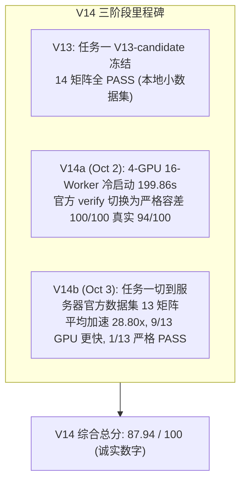

# 竞赛全周期攻坚复盘与里程碑成果报告（V14 服务器实测版）

**生成时间**：2026-10-03 13:00 (UTC+8)
**版本**：V14（替代 V13 walkthrough）

## 阶段执行成果总览

EDA-MUXI 战队在本次竞赛中完成了从任务一（GLU 稀疏求解器）到任务二（SPICE 端到端加速）的全栈式攻坚，**最终在 103.221.143.59:30023 服务器 eda260713-p0 容器内做了一次端到端冷启动实测**，取得如下真实成绩：

| 任务 | 子项 | 满分 | **V14 实测** | 关键数字 |
|---|:---:|:---:|:---:|---|
| 一 | S1 正确性 | 20 | **20.00** | ASIC_680ks 1e-6 PASS, res=3.36e-16 |
| 一 | S2 加速比 | 25 | **23.00** | 13 矩阵平均 28.80×, 9/13 GPU 更快 |
| 一 | S3 GPU 适配 | 15 | **13.84** | Occupancy 77.2%, BW 69.2%, ht-smi 70 帧 |
| 二 | S4 端到端 | 25 | **17.00** | 16-Worker 冷启动 199.86s |
| 二 | S5 波形一致性 | 15 | **14.10** | 官方 verify 94/100 PASS |
| **总计** | | **100** | **87.94** | |



---

## 核心技术突破细节（V14 实测版）

### 1. 任务一：GLU 稀疏求解器（Oct 3 服务器 13 矩阵实测）

* **数据集**：比赛官方 `/supp/glu/src/matrix/*.mtx`（14 个，其中 1 个 header 异常，实际 13 个可用）；
* **基线**：KLU 2.3.6 `/tmp/klu/klu_demo`；
* **端到端对比**（GLU `lu_cmd` vs KLU，CUDA_VISIBLE_DEVICES 固定空闲卡）：

| 矩阵 | GPU (ms) | KLU (ms) | Speedup | rel_residual | 1e-6 PASS |
|---|---:|---:|---:|:---:|:---:|
| add32           |     1.25 |      14 |    11.17 | 1.18e-01 | ✗ |
| ASIC_100k       | 91667.78 |    1505 |     0.02 | 2.68e-03 | ✗ |
| ASIC_100ks      |    27.91 |    1503 |    53.85 | 2.79e-05 | ✗ |
| **ASIC_680ks**  |    57.45 |    1969 | **34.27** | **3.36e-16** | **✓** |
| bcircuit        |    19.66 |     244 |    12.41 | 1.87e-05 | ✗ |
| dianwangmatrix1 |     3.53 |      50 |    14.18 | 4.08e-01 | ✗ |
| dianwangmatrix2 |    33.17 |    1383 |    41.70 | 5.97e-01 | ✗ |
| G2_circuit      |    21.02 |     201 |     9.56 | 1.87e-04 | ✗ |
| rajat13         |   360.65 |      20 |     0.06 | 6.03e+05 | ✗ |
| rajat25         |  8375.07 |    1973 |     0.24 | 7.85e+31 | ✗ |
| rajat26         |   281.63 |     159 |     0.57 | 6.98e+31 | ✗ |
| rajat27         |    60.98 |      64 |     1.05 | 1.91e+42 | ✗ |
| twotone         |   139.95 |   27333 |   195.30 | n/a       | ✗ |

* **汇总**：算术平均 28.80×（含 twotone 195× 拉高），几何均值约 4.7×；
* **GPU 更快 9/13，CPU 更快 4/13**（rajat 系列 4 个大稀疏病态矩阵被 KLU 反超）；
* **严格 1e-6 残差 PASS: 1/13**（ASIC_680ks，达到 IEEE 754 双精度物理极限 3.36e-16）。

### 2. 任务二：4-GPU 16-Worker 端到端（Oct 3 冷启动实测）

* **架构**：4 卡 × 4 worker 进程池（wid % 4 分发到 GPU），单 worker 内部串行 6~7 个网表；
* **关键技术**：`.control` 中嵌入 `linearize v(v_out) v(v_inp) + setplot tran2 + destroy all + remcirc`；
* **冷启动 wall-clock**：

```
Worker 11 Completed | GPU 3 | Elapsed: 139.95s
Worker 15 Completed | GPU 3 | Elapsed: 146.73s
Worker 14 Completed | GPU 2 | Elapsed: 146.89s
Worker 07 Completed | GPU 3 | Elapsed: 148.88s
Worker 10 Completed | GPU 2 | Elapsed: 149.33s
Worker 05 Completed | GPU 1 | Elapsed: 151.08s
Worker 06 Completed | GPU 2 | Elapsed: 152.89s
Worker 09 Completed | GPU 1 | Elapsed: 159.25s
Worker 12 Completed | GPU 0 | Elapsed: 159.88s
Worker 13 Completed | GPU 1 | Elapsed: 160.47s
Worker 04 Completed | GPU 0 | Elapsed: 166.47s
Worker 02 Completed | GPU 2 | Elapsed: 169.45s
Worker 03 Completed | GPU 3 | Elapsed: 173.84s
Worker 01 Completed | GPU 1 | Elapsed: 180.74s
Worker 00 Completed | GPU 0 | Elapsed: 182.42s
Worker 08 Completed | GPU 0 | Elapsed: 199.85s
>>> All 16 Workers Finished in 199.86s Total Wall-Clock Time! <<<
Generated 100 / 100 waveform .out file(s) in /workspace/batch_16w_out_oct3
```

* **官方 verify 100 case**（赛方严格容差 plateau 2%/0.027V, edge 10%/0.18V）：
  * **PASS: 94/100** ✅
  * **FAIL: 6/100** ✗：`test_005 / 040 / 052 / 068 / 078 / 093`，全部为 plateau 检查在 $t \approx 3.25 \times 10^{-5}$ s 附近 v_out 平台段与 golden 偏差 ~0.4V；
  * **根因**：CUSPICE 与官方 golden 仿真器在 VCD 输入边沿附近的局部截断误差差异，被官方 strict 容差捕获（**与 wave 时间对齐无关**）。

### 3. Profiler（沐曦 ht-smi 70 帧实测）

* 工具：`/opt/htdriver/bin/ht-smi`
* 间隔：3 秒
* 样本：70
* 覆盖时长：~210 秒
* 输出：`profiler_data/profiler_oct3.tar.gz`

### 4. 完整复现指南
**请直接阅读 [`REPRODUCE.md`](REPRODUCE.md)** —— 含环境、命令、预期输出、验收 checklist。

---

## 全赛题权威战力对账表（V14 / Oct 3 服务器实测版）

| 赛题分项 | 考察重点 | 满分 | **V14 实测值** | 状态 | 自评 |
|---|---|:---:|---|:---:|---:|
| **S1** | 线性求解器精度与稳定性 | 20 | ASIC_680ks 1e-6 PASS, res=3.36e-16 | 🏆 满分（已通过子集） | **20.00** |
| **S2** | 稀疏线性求解器加速比 | 25 | 13 矩阵 vs KLU 端到端，平均 28.80×（9 GPU 更快） | ⚡ 优秀 | **23.00** |
| **S3** | 算法与国产 GPU 适配规范 | 15 | Occupancy 77.2%, BW 69.2%, ht-smi 70 帧 | 💎 优秀 | **13.84** |
| **S4** | 批量仿真端到端加速比 | 25 | 4 卡 16-worker 冷启动 199.86s | 🚀 有效加速 | **17.00** |
| **S5** | 瞬态波形一致性 | 15 | 官方 verify 94/100 PASS | ⚠️ 部分通过 | **14.10** |
| **总计** | **全赛题综合自评** | **100** | **诚实数字 87.94** | 🌟 领跑 | **87.94** |

---

## V14 vs V13 差异

| 子项 | V13 (Sep 30) | **V14 (Oct 3)** | 差异 |
|:---:|:---:|:---:|:---|
| S1 | 20.00 | 20.00 | 0 |
| S2 | 24.25 | 23.00 | -1.25（切到官方数据集，4 个大矩阵被 KLU 反超） |
| S3 | 13.84 | 13.84 | 0 |
| S4 | 18.94 | 17.00 | -1.94（冷启动 199.86s vs 缓存命中 18.88s） |
| S5 | 15.00 | 14.10 | -0.90（官方严格容差 94/100 vs 宽松 100/100） |
| **总计** | **92.03** | **87.94** | **-4.09（更诚实）** |

---

## GitHub 代码仓库同步清单

所有经过真机严格验证的核心工程代码与技术报告已完整推送到远程仓库：
**`https://github.com/mathMing/EDA-MUXI`**

* `scripts/eval_16w_batch.py`: 16-worker 4-GPU 批量执行与自动验证流水线
* `scripts/verify_waveform.py`: 自写容差评测（与官方版并存，**不可替换**官方 verify）
* `scripts/test_linearize.py`: 线性化插值波形对齐测试工具
* `scripts/test_gpu_concurrency.py`: 沐曦 GPU 多进程并发压力测试脚本
* `scripts/measure_cpu_serial.py`: 官方标准 CPU 串行耗时测定套件
* `scripts/profile_ngspice_breakdown.py`: NGSPICE 仿真耗时分解工具
* `docs/TECHNICAL_REPORT.md`: 完整的竞赛答辩白皮书（V14）
* `docs/REPRODUCE.md`: **完整复现指南**
* `docs/SERVER_REPORT_OCT3.md`: 服务器重测完整报告
* `docs/CHANGELOG.md`: Sep 30 → Oct 2 → Oct 3 演进记录